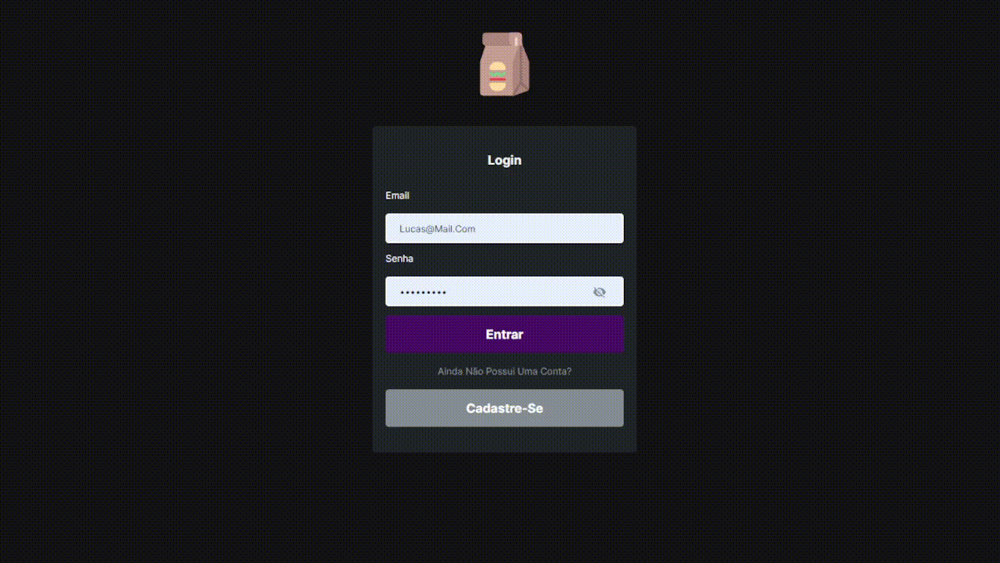

## Este projeto foi feito para cumprir o desafio fullstack da empresa Salvus
### Desafio para a vaga "WEB DESENVOLVEDOR DE SISTEMA"



## Todas as ferramentas utilizadas:
```json
  "dependencies": {
    "@hookform/resolvers": "^3.3.2",
    "axios": "^1.5.1",
    "jwt-decode": "^4.0.0",
    "react": "^18.2.0",
    "react-dom": "^18.2.0",
    "react-hook-form": "^7.47.0",
    "react-icons": "^4.11.0",
    "react-router-dom": "^6.16.0",
    "react-toastify": "^9.1.3",
    "sass": "^1.69.3",
    "zod": "^3.22.4"
  },
```

 ### Para rodar o projeto,
 ### Clone o repositório

rode o comando:
```json
npm install
```

iniciar o projeto:
```json
npm run dev
```

### Origem da api
```
https://github.com/iluucasz/desafio_fullstack_salvus_api
```


